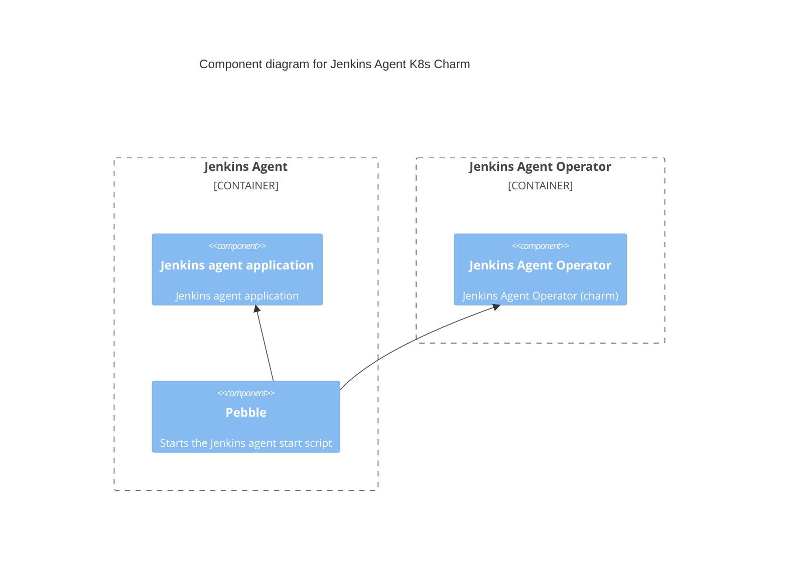

# Charm architecture

The jenkins-agent-k8s charm aims to provide core functionalities of
[Jenkins agents](https://www.jenkins.io/doc/book/managing/nodes#components-of-distributed-builds),
which are Java applications executing the jobs on behalf of
[Jenkins](https://www.jenkins.io/) itself.

## Containers

The core component of jenkins-agent-k8s charm consists of a jenkins-agent-k8s main workload
container. The Jenkins agent inside the container is driven by Pebble, a lightweight API-driven
process supervisor that controls the lifecycle of a service. Learn more about Pebble and its layer
configurations [in the Pebble documentation](https://github.com/canonical/pebble).



### Jenkins agent

The Jenkins agent application integrates with the main Jenkins controller and receives scheduled jobs
to run. Once the agent receives registration token from the Jenkins integration, it will
start downloading the compatible agent JNLP from the main Jenkins controller server and launch
the agent application. The agent JAR is downloaded as `/var/lib/jenkins/agent.jar`.

To indicate any startup failures, the `/var/lib/jenkins/agents.ready` file is created just before
starting the agent application and removed if the agent was not able to start successfully.

### Jenkins agent operator

This container is the main point of contact with the Juju controller. It communicates with Juju to
run necessary charm code defined by the main `src/charm.py`. The source code is copied to the
`/var/lib/juju/agents/unit-UNIT_NAME/charm` directory.

## OCI images

We use [Rockcraft](https://canonical-rockcraft.readthedocs-hosted.com/en/latest/) to build the OCI Image for the Jenkins agent. 
The image is defined in the [Jenkins agent k8s rock](https://github.com/canonical/jenkins-agent-k8s-operator/blob/main/jenkins_agent_k8s_rock/).
They are published to [Charmhub](https://charmhub.io/), the official repository of charms.
This is done by publishing a resource to Charmhub as described in the [Juju SDK How-to guides](https://juju.is/docs/sdk/publishing).

### Jenkins agent K8s

The [Jenkins agent K8s rock](https://github.com/canonical/jenkins-agent-k8s-operator/blob/main/jenkins_agent_k8s_rock/) defines the workload for the Jenkins agent K8s container. This container manages the task execution on behalf of the Jenkins controller by using executors. It contains an agent, a small  Java client process that connects to a Jenkins controller and is assumed to be unreliable. Any tools required for building and testing get installed on this container, where the agent runs.

## Integrations

### Jenkins

The [Jenkins](https://charmhub.io/jenkins-k8s) controller, a CI server for which this agent charm will run tasks.

## Juju events

For this charm, the following events are observed:

1. [`jenkins_agent_k8s_pebble_ready`](https://documentation.ubuntu.com/juju/3.6/reference/hook/#container-pebble-ready): fired on Kubernetes charms when the requested container is ready.
Action: wait for the integrations and configuration, download the JAR, configure the container and re-plan the service.
2. [`config_changed`](https://documentation.ubuntu.com/juju/3.6/reference/hook/#config-changed): usually fired in response to a configuration change using the CLI.
Action: wait for the integrations and configuration, download the JAR, configure the container and re-plan the service.
3. [`upgrade_charm`](https://documentation.ubuntu.com/juju/3.6/reference/hook/#upgrade-charm): fired when a charm upgrade is triggered.
Action: wait for the integrations and configuration, download the JAR, configure the container and re-plan the service.
4. [`agent_relation_joined`](https://documentation.ubuntu.com/juju/3.6/reference/hook/#endpoint-relation-joined): emitted when a unit joins the relation.
Action: download the JAR, configure the container and re-plan the service.
5. [`agent_relation_changed`](https://documentation.ubuntu.com/juju/3.6/reference/hook/#endpoint-relation-changed): triggered when another unit involved in the relation changed the data in the relation data bag.
Action: download the JAR, configure the container and re-plan the service.
6. [`agent_relation_departed`](https://documentation.ubuntu.com/juju/3.6/reference/hook/#endpoint-relation-departed): fired when a unit departs the relation.
Action: stop the service.

## Charm code overview

The `src/charm.py` is the default entry point for a charm and has the JenkinsAgentCharm Python class which inherits from CharmBase.

CharmBase is the base class from which all Charms are formed, defined by [Ops](https://juju.is/docs/sdk/ops) (Python framework for developing charms).

See more information in [Charm](https://canonical-juju.readthedocs-hosted.com/en/3.6/user/reference/charm/).

The `__init__` method guarantees that the charm observes all events relevant to its operation and handles them.

Take, for example, when a configuration is changed by using the CLI.

1. User runs the command:
```bash
juju config jenkins_agent_name=agent-one
```
2. A `config-changed` event is emitted.
3. In the `__init__` method is defined how to handle this event like this:
```python
self.framework.observe(self.on.config_changed, self._on_config_changed)
```
4. The method `_on_config_changed`, for its turn,  will take the necessary actions such as waiting for all the relations to be ready and then configuring the containers.